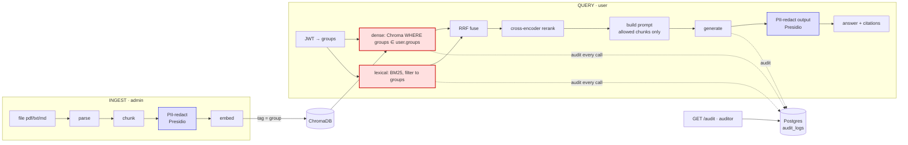

# RAG Compliance Engine

[](LICENSE)


RAG with access control, audit, and PII redaction enforced at the data layer — not the prompt.

## Why this is different

1. **Access control at retrieval, not in the prompt.** A chunk is filtered out of the
   candidate set by the vector store before anything reaches the LLM. A marketing user
   *cannot* retrieve a finance chunk, so no prompt injection can leak it. The guarantee
   holds on both the dense (vector) arm and the lexical (BM25) arm.
2. **Provable audit trail.** Every query logs who asked, which chunks were returned
   (id, source, score), how many were withheld by access control (`filtered_out_count`),
   the exact prompt, the model, and the response. Note: the `score` field is the
   cross-encoder rerank relevance score (higher = more relevant), or the RRF fused
   score if reranking fell back.
3. **PII redacted on the way in *and* the way out.** Documents are redacted with Presidio
   before embedding, and every generated answer is redacted again before it leaves the API.
   The audit records what the output pass removed (`output_redactions`), and if that pass
   can't run, the query fails closed (500) rather than return an unverified answer.
4. **Hard multi-tenant isolation.** Each tenant's vectors live in a physically separate
   Chroma collection (`chunks__<tenant>`), so a query for one tenant runs against only that
   tenant's data — cross-tenant retrieval is impossible by construction, not just filtered.
   Audit rows are tenant-scoped; an auditor sees only their own tenant.

## Architecture



The red nodes are the security boundary: the dense arm enforces access **in the vector
store** (a Chroma `WHERE groups ∈ user.groups` clause), while the in-memory BM25
(lexical) arm has no WHERE clause and filters in the application layer before fusion.
Providers sit behind `VectorStore` / `LLMProvider` interfaces — Chroma + Ollama locally,
AWS Bedrock + OpenSearch via `RCE_BACKEND=aws` ([see below](#deploying-on-aws-bedrock--opensearch)),
with no change to the pipeline in between.

Retrieval is two-stage: dense (vector) and BM25 (lexical) recall are fused with
Reciprocal Rank Fusion, then a cross-encoder reranks the candidates. **Both arms
filter to the user's groups before fusion**, so the access guarantee holds on every
retrieval path — the new lexical arm can't surface a chunk the dense arm couldn't.

## Quickstart (5 minutes)

> Slices 3–4 added audit/document columns (`output_redactions`, `tenant_id`). If you ran an
> earlier slice, reset the database first: `docker compose down -v`, then bring the stack back
> up. Alembic migrations are the *planned* production upgrade path; the demo recreates the DB.

```bash
docker compose up -d --build
docker compose exec ollama ollama pull nomic-embed-text
docker compose exec ollama ollama pull llama3
docker compose exec app python seed.py   # prints sample bearer tokens
```

Query as marketing-user Alice (gets only marketing docs):

```bash
curl -s localhost:8000/query \
  -H "Authorization: Bearer <ALICE_TOKEN>" \
  -H "Content-Type: application/json" \
  -d '{"query":"what is the marketing plan?"}' | jq
```

Then pull the audit record and see `filtered_out_count` prove the finance chunk was withheld:

```bash
curl -s localhost:8000/audit -H "Authorization: Bearer <AUDITOR_TOKEN>" | jq '.[0]'
```

## Deploying on AWS (Bedrock + OpenSearch)

The retrieval and LLM layers sit behind `VectorStore` / `LLMProvider` interfaces, so switching
from the local stack to AWS is one env var — no pipeline changes:

```bash
RCE_BACKEND=aws \
RCE_OPENSEARCH_URL=https://<your-opensearch-endpoint> \
RCE_EMBED_MODEL=amazon.titan-embed-text-v2:0 \
RCE_EMBED_DIM=1024 \
RCE_GEN_MODEL=anthropic.claude-3-5-sonnet-20240620-v1:0 \
RCE_AWS_REGION=us-east-1
# plus standard AWS credentials in the environment
```

`local` (default) uses Ollama + ChromaDB; `aws` uses Bedrock (embeddings + Converse) and
OpenSearch (per-tenant kNN indexes with the same group access filter).

> The AWS providers are implemented against the `boto3` / `opensearch-py` contracts and covered
> by unit tests with mocked clients; they are not exercised against live AWS in this repo. Point
> them at a real account by setting the variables above.

## Roadmap

Slice 1: security spine (access control + audit) ✅ · Slice 2: hybrid retrieval + rerank ✅ · Slice 3: output-side PII ✅ · Slice 4: multi-tenant ✅ · Slice 5: AWS (Bedrock + OpenSearch) ✅.

## Tests

```bash
cd src && pip install -r requirements.txt
# Presidio requires the en_core_web_lg spaCy model (~560 MB); download it once:
python -m spacy download en_core_web_lg
pytest -v
```

## Contributing & Security

Contributions welcome — see [CONTRIBUTING.md](CONTRIBUTING.md). Because this is a
security/compliance project, please report vulnerabilities privately per
[SECURITY.md](SECURITY.md) rather than opening a public issue.

## License

[MIT](LICENSE) © Weerayut Teja
