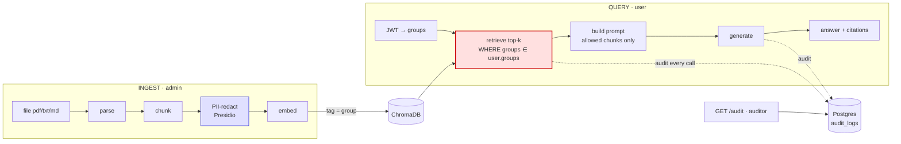

# RAG Compliance Engine

RAG with access control, audit, and PII redaction enforced at the data layer — not the prompt.

## Why this is different

1. **Access control at retrieval, not in the prompt.** A chunk is filtered out of the
   candidate set by the vector store before anything reaches the LLM. A marketing user
   *cannot* retrieve a finance chunk, so no prompt injection can leak it.
2. **Provable audit trail.** Every query logs who asked, which chunks were returned
   (id, source, score), how many were withheld by access control (`filtered_out_count`),
   the exact prompt, the model, and the response. Note: the `score` field is a vector
   distance (lower = closer match), not a similarity score.
3. **PII never enters the index.** Documents are redacted with Presidio before embedding.

## Architecture



The red node is the security boundary: access filtering happens **in the vector store**, so
finance chunks never enter a marketing user's candidate set — prompt injection can't reach data
that was never retrieved. Providers sit behind `VectorStore` / `LLMProvider` interfaces
(Chroma + Ollama now; AWS Bedrock + OpenSearch later).

## Quickstart (5 minutes)

```bash
docker compose up -d --build
docker compose exec ollama ollama pull nomic-embed-text
docker compose exec ollama ollama pull llama3
docker compose exec app python seed.py   # prints sample bearer tokens
```

Query as marketing-user Alice (gets only marketing docs):

```bash
curl -s localhost:8000/query \
  -H "Authorization: Bearer <ALICE_TOKEN>" \
  -H "Content-Type: application/json" \
  -d '{"query":"what is the marketing plan?"}' | jq
```

Then pull the audit record and see `filtered_out_count` prove the finance chunk was withheld:

```bash
curl -s localhost:8000/audit -H "Authorization: Bearer <AUDITOR_TOKEN>" | jq '.[0]'
```

## Roadmap

Slice 2: hybrid retrieval + rerank · Slice 3: output-side PII · Slice 4: multi-tenant · Slice 5: AWS (Bedrock + OpenSearch).

## Tests

```bash
cd src && pip install -r requirements.txt
# Presidio requires the en_core_web_lg spaCy model (~560 MB); download it once:
python -m spacy download en_core_web_lg
pytest -v
```
